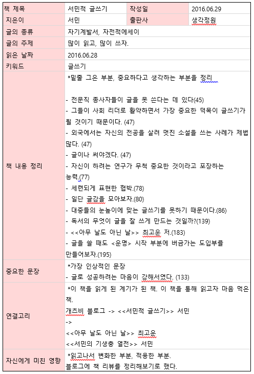

책을 그저 마구 읽기만 하는 활자 중독이라는 느낌이 들어서 조금 더 잘 읽어보고자 독서법에 관한 책을 여럿 읽고 있다.  
그렇게 4권 정도 읽다 보니 결국 비슷한 이야기를 하고 있는 게 보인다.  
- 목적을 가지고 읽기
- 질문을 던지며 읽기
- 중간중간 메모도 하고 귀퉁이도 접어 놓는 등 필요하다면 책을 아끼지 말기
- 읽은 후에는 다시 한 번 써 보는 것으로 정리하기

모두가 알고 있듯이 실천이 중요한 것이다.  
나는 오늘 한 걸음 내디뎠다.

일단 종이의 재질, 책의 무게, 그립감, 잉크의 진하기와 내부 디자인, 표지 디자인...  
개츠비 블로그를 통해서 알게 되었기에 읽기는 하겠지만, 내 나름의 검열을 피할 수는 없다.  
내 손과 눈이 마음에 들어하는 것을 확인하고 나서 읽기를 시작했다.  

하루키의 책과 마찬가지로 문체가 마음에 들었다.  
자가 자부하는 것처럼 솔직하고 시원시원하면서 문장이 길지 않아 쉽게 읽혔다.  
머를 넣는 다고는 했지만, 실제로 재미있는 부분의 비중은 크지 않았다.  
그래도 덕분에 지루한 문체가 되지는 않았다.  

대중이 쉽게 접할 수 없는 기생충에 대해서 쉽게 풀어쓴 책을 펴냈다는 것이 대단하게 느껴졌다.  
쓰기를 꾸준히 해야 하는 이유가 될 만 하다.  
앞으로 읽을 책뿐만 아니라 지금까지 읽은 책들도 한 권 한 권 리뷰를 해둬야겠다.

