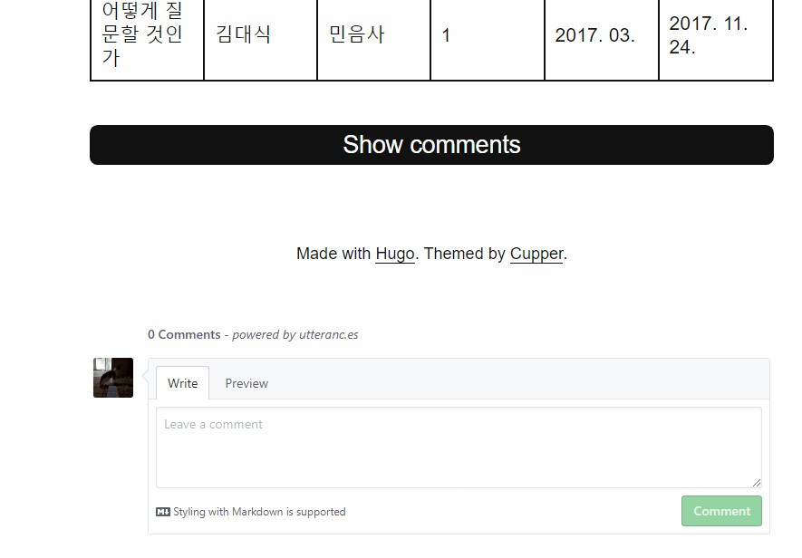
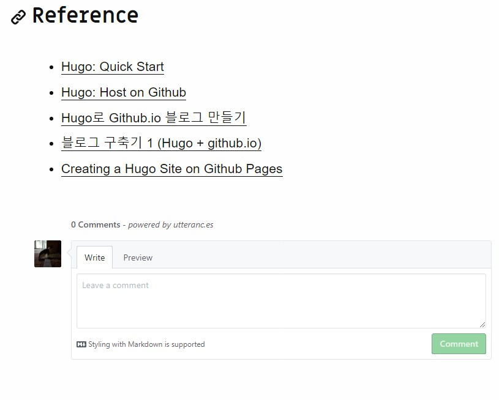

## 서론

댓글 기능이 꼭 필요할 것 같지는 않지만, [좋은 레퍼런스](#reference)를 찾았기 때문에 일단 시도했다.  
이 글에는 utterrances 소개는 관두고... 설치 관련 내용만 적었다.

## utterances 설치

### 1. utterances 사이트 접속

[여기](https://utteranc.es/)로 이동해서 `configuration` 부분을 따라한다.

### 2. Public 저장소 생성
나는 **bloght-comments** 라고 만들었다.

### 3. Blog Post ↔️ Issue Mapping, Theme 선택

`Blog Post ↔️ Issue Mapping`은 세 번째 옵션을(Title 기준 매칭),  
`Theme`은 내 블로그가 밝으니 `Github Light`를 선택했다.

### 4. Enable Utterances

`Enable Utterances` 부분에 있는 코드를 내 블로그 템플릿 중 원하는 부분에 붙여넣으라고 한다.  
각 게시글 맨 아래에 댓글 부분이 나타나게 하려면 어디에 그 코드를 붙여 넣어야 할까. 나는 `Hugo`가 어떻게 작동하는지 잘 모르니까 `hugo server`로 로컬 사이트를 켠 상태에서 원하는 위치를 찾아보겠다. 지난번 테마 커스텀할 때 각 게시글 맨아래는 `footer.html`에 담겨있었던 것 같으니 거기부터 시도.

```
<footer role="contentinfo">
  {{ with .Site.Params.footer }}
    {{ . | markdownify }}
  {{ end }}
</footer>
```

위와 같은 `footer.html`을 아래와 같이 바꿨다:

```
<footer role="contentinfo">
  {{ with .Site.Params.footer }}
    {{ . | markdownify }}
  {{ end }}
  <script src="https://utteranc.es/client.js"
        repo="hoontaeklee/bloght-comments"
        issue-term="title"
        theme="github-light"
        crossorigin="anonymous"
        async>
</script>
</footer>
```

원하는 결과가 나왔다:



한 가지 문제가 있다. 원래 `Cupper` 테마는 댓글 플러그인으로 `Disqus` 사용을 전제로 만들어진 것 같다. 위 그림의 `Show comments` 버튼을 누르면 "Disqus comments are disabled."라는 메시지가 뜬다. 두 가지 안이 있다.

1. 저 버튼을 살리면서 `Disqus`를 `utterances`로 교체: 버튼 디자인이 테마와 잘 어울린다
2. 저 버튼과 `Disqus`를 한 번에 제거

버튼이 이쁘니 1안을 시도해보자.

## Disqus를 utterances로 대체

각 게시글의 레이아웃 정보는 `post/single.html`에 담겨있다. 역시 테마 커스터마이징 때 삽질했던 게 도움이 된다(ㅜㅜ).  

`single.html`을 보면 맨 아랫줄에
```
</main>
{{ partial "disqus.html" . }}
{{ end }}
```
위와 같이 `partial`에 있는 `disqus.html`을 불러오도록 돼 있다. `disqus.html`을 확인해보자.

```
<div id="disqus-container">
  {{ with .Site.DisqusShortname }}
    <button id="disqus-button" onclick="showComments()">Show comments</button>
    <div id="disqus-comments">
      {{ $isDummyName := eq . "yourdiscussshortname" }}
      {{ $isServer := $.Site.IsServer }}
      {{ if or $isDummyName $isServer }}
        <p><em>Disqus comments are disabled.</em></p>
        <script type="application/javascript">
          function showComments() {
            {{ partial "disqus-js-common.js" . | safeJS }}
          }
        </script>
      {{ else }}
        <div id="disqus_thread">
        </div>
        <script type="application/javascript">
          function showComments() {
            {{ partial "disqus-js-main.js" . | safeJS }}
            {{ partial "disqus-js-common.js" . | safeJS }}
          }
        </script>
      {{ end }}
      <noscript>Enable JavaScript to view Disqus comments.</noscript>
    </div>
  {{ end }}
</div>
```

`disqus.html`을 보면... 첫 부분에 `<button id="disqus-button" onclick="showComments()">Show comments</button>`와 같이 내가 보전하려 했던 버튼을 생성하는 듯한 코드가 보인다. 클릭하면 `showComments()`라는 함수가 작동하는 것 같다.  
다음으로 `if` 조건문이 등장하는데, `disqus`가 `off`일 경우, `on`일 경우가 순서대로 적혀있다. 현재 나는 `disqus`를 설치하지 않았고, 버튼을 클릭하면 `disqus 없다`는 메시지가 나타난다. `on`일 경우는 어찌됐든 상관 없으니 지우고, `if`문 형식도 지우고, `off`인 경우 실행되는 코드만 살린다. 이 부분에서 메시지를 띄우는 듯한 `<p><em>Disqus comments are disabled.</em></p>`을 지우고 `utterances` 사이트에서 복사했던 코드를 붙여 넣자. 그럼 아래와 같이 남는다.

```
<div id="disqus-container">
  {{ with .Site.DisqusShortname }}
    <button id="disqus-button" onclick="showComments()">Show comments</button>
    <div id="disqus-comments">
      {{ $isDummyName := eq . "yourdiscussshortname" }}
      {{ $isServer := $.Site.IsServer }}
        <script type="application/javascript">
          function showComments() {
            {{ partial "disqus-js-common.js" . | safeJS }}
          }
        </script>
        <script src="https://utteranc.es/client.js"
              repo="hoontaeklee/bloght-comments"
              issue-term="title"
              theme="github-light"
              crossorigin="anonymous"
              async>
        </script>
      <noscript>Enable JavaScript to view Disqus comments.</noscript>
    </div>
  {{ end }}
</div>
```

웹페이지를 보면



잘 나왔다. `Show comments` 버튼을 클리하면 위 그림과 같이 나온다.  

## Reference

- [Hugo로 Github.io 블로그 만들기](https://github.com/Integerous/Integerous.github.io)
