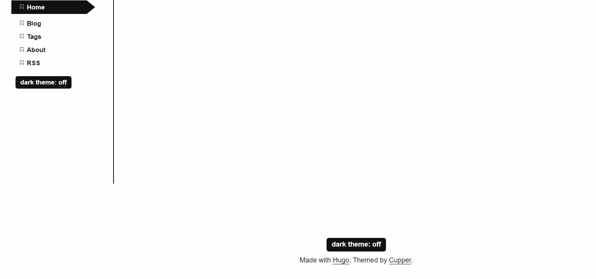
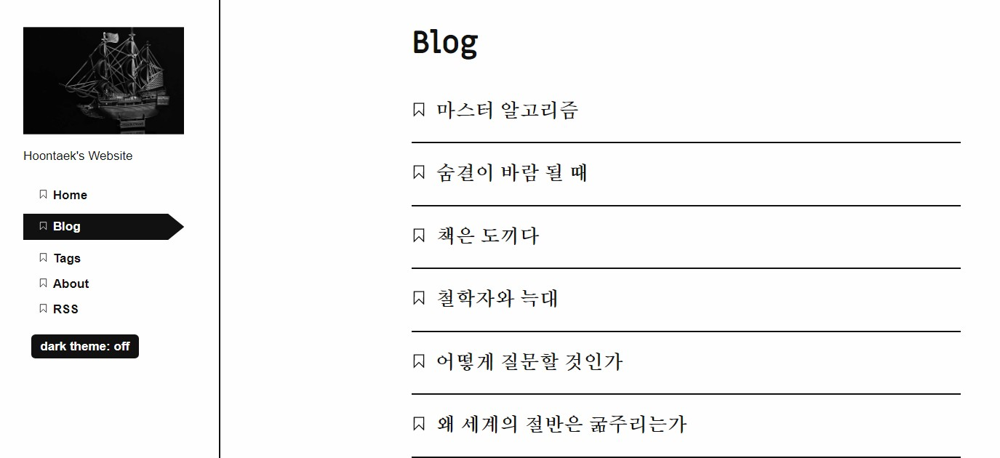
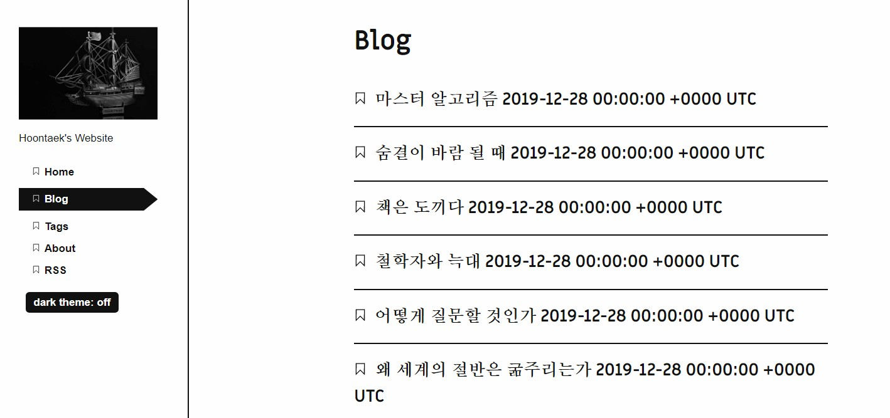
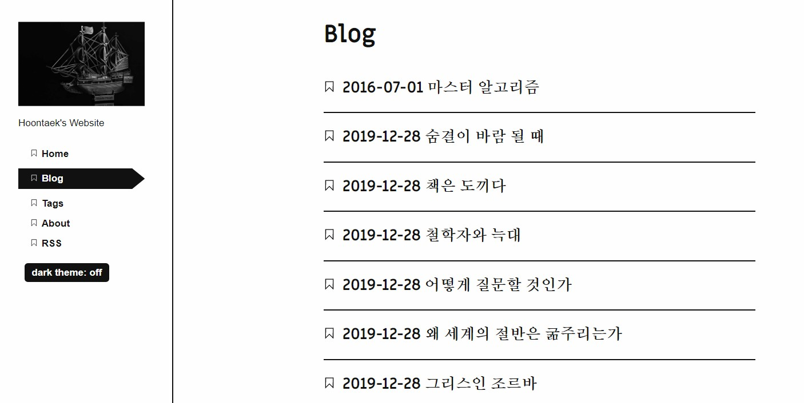
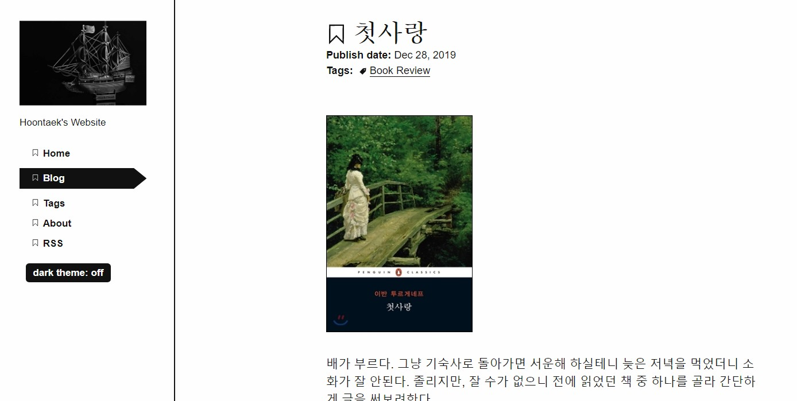
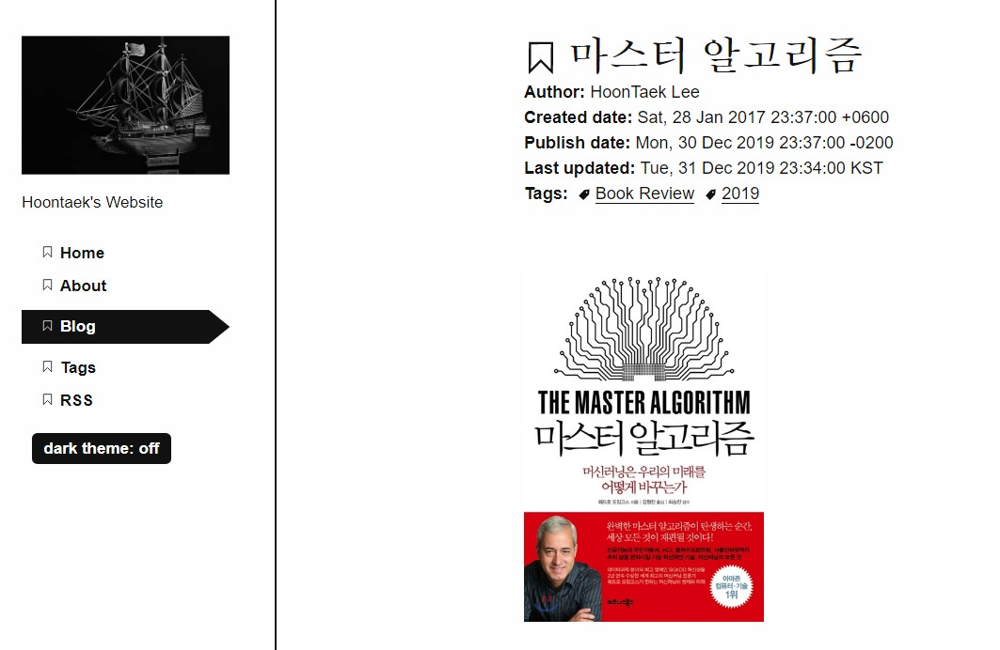

## 목차

<!-- TOC -->

- [문의 사항](#%EB%AC%B8%EC%9D%98-%EC%82%AC%ED%95%AD)
- [1. **Dark/Light 버튼 위치 변경**](#1-darklight-%EB%B2%84%ED%8A%BC-%EC%9C%84%EC%B9%98-%EB%B3%80%EA%B2%BD)
- [2. **포스팅 날짜 및 시간 정보 추가**](#2-%ED%8F%AC%EC%8A%A4%ED%8C%85-%EB%82%A0%EC%A7%9C-%EB%B0%8F-%EC%8B%9C%EA%B0%84-%EC%A0%95%EB%B3%B4-%EC%B6%94%EA%B0%80)
- [3. **.md 파일 내 게시 날짜와 실제 날짜가 같으면 게시글이 사라지는 문제**](#3-md-%ED%8C%8C%EC%9D%BC-%EB%82%B4-%EA%B2%8C%EC%8B%9C-%EB%82%A0%EC%A7%9C%EC%99%80-%EC%8B%A4%EC%A0%9C-%EB%82%A0%EC%A7%9C%EA%B0%80-%EA%B0%99%EC%9C%BC%EB%A9%B4-%EA%B2%8C%EC%8B%9C%EA%B8%80%EC%9D%B4-%EC%82%AC%EB%9D%BC%EC%A7%80%EB%8A%94-%EB%AC%B8%EC%A0%9C)
- [4. **시간 내림차순 정렬**](#4-%EC%8B%9C%EA%B0%84-%EB%82%B4%EB%A6%BC%EC%B0%A8%EC%88%9C-%EC%A0%95%EB%A0%AC)
- [후기](#%ED%9B%84%EA%B8%B0)
<!-- /TOC -->

블로그 테마로 [Cupper](https://github.com/zwbetz-gh/cupper-hugo-theme)를 선택했다.
기본 세팅에서 네 가지 고치고 싶은 사항이 있어 [Hugo Forum에 문의했다.](https://discourse.gohugo.io/t/four-issues-about-the-cupper-theme-dark-button-posting-time-and-an-error/22523)

## 문의 사항

> Four issues about the cupper theme (dark button, posting time, and an error)
I am building a static website using the Cupper theme (https://github.com/zwbetz-gh/cupper-hugo-theme).
I have four issues:
1. How can I move the position of dark/light button?
The button is currently located at the bottom of a post. However, I think the readers should be allowed to change between the dark/light scene before they start to read. Therefore I want to move the button to the bottom of the left part of the theme.
2. How can I add more information about posting time on the blog page and in each writing?
The cupper theme currently lists up the postings on the blog page, only with the titles. I want to have more information on the page (posting date and time). Also, in each writing, the theme provides the posting date (e.g. 2019-12-28). However, I want to add up the posting time information (e.g. 2019-12-28 14:24:49).
3. Why the posting disappears on the blog and tag pages when I set the “date” and “publishdate” parameters of the front matter of each posting as that of today?
For example, let’s say I am posting AA on 2019-12-29. When I set the “date” (or “publishdate”) parameter as 2019-12-28 and build the site locally (hugo server), I can see my post and related tags on the blog and tags pages. However, when I reset the “date” (or “publishdate”) parameter as “2019-12-29” and after the local server automatically updates the change, my posting AA has disappeared from the blog and tags pages.
4. Reordering the list of posts in order of the latest.
On the blog page, the oldest post is shown at the top. I want to reverse this rule (i.e. recent posts are on the top and old posts are at the bottom).
Thank you
@zwbetz

요약하면,

1. **Dark/Light 버튼 위치 변경**: 각 게시글의 맨 밑이 아니라 왼쪽 메뉴 맨 아래로 이동해서 언제나 눈에 띄도록 하고 싶다.
2. **포스팅 날짜 및 시간 정보 추가**: Blog 버튼을 클릭하면 각 게시글 제목만 쭉 나열된다. 여기에 포스팅 날짜 정보도 추가하고 싶다. 그리고 각 게시글을 열면 게시 날짜가 yyyy-mm-dd 형식으로 나타나는데, 여기에도 시간 정보를 추가하고 싶다.
3. **md 파일 내 게시 날짜와 실제 날짜가 같으면 게시글이 사라지는 문제**: 아마 포스팅 날짜가 yyyy-mm-dd 형식이다보니 그런 듯.
4. **시간 내림차순 정렬**: Blog 버튼 클릭하면 시간 오름차순으로 게시글이 정렬된다. 내림차순으로 바꾸고 싶다.

Theme 저자인 `zwbetz`이 답변을 해줬다.

## 1. **Dark/Light 버튼 위치 변경**

### 답변: footer.html 수정

`.\themes\cupper-hugo-theme\layouts\partials\footer.html`에서 div로 둘러싸인 부분을 내가 원하는 곳으로 복붙하기. 아마 nav로 옮기면 될 거라 한다.

footer.html 파일을 보면...

```
<footer role="contentinfo">

# 여기부터
  <div>
    <label for="themer">
      dark theme: <input type="checkbox" id="themer" class="vh">
      <span aria-hidden="true"></span>
    </label>
  </div>
# 여기까지

  {{ with .Site.Params.footer }}
    {{ . | markdownify }}
  {{ end }}
</footer>
```

nav.html 파일을 보면...

```
<nav id="patterns-nav" class="patterns" role="navigation">
  <h2 class="vh">Main navigation</h2>
  <button id="menu-button" aria-expanded="false">
    <svg viewBox="0 0 50 50" aria-hidden="true" focusable="false">
      <use xlink:href="#menu"></use>
    </svg>
    Menu
  </button>
  {{ $current := . }}
  <ul id="patterns-list">
  {{ range .Site.Menus.nav }}
    <li class="pattern">
      {{ $active := or ($current.IsMenuCurrent "nav" .) ($current.HasMenuCurrent "nav" .) }}
      {{ $active = or $active (eq .Name $current.Title) }}
      {{ $active = or $active (and (eq .Name "Blog") (eq $current.Section "post")) }}
      {{ $active = or $active (and (eq .Name "Tags") (eq $current.Section "tags")) }}
      <a href="{{ .URL }}" {{ if $active }}aria-current="page"{{ end }}>
        <svg class="bookmark-icon" aria-hidden="true" focusable="false" viewBox="0 0 40 50">
          <use xlink:href="#bookmark"></use>
        </svg>
        <span class="text">{{ .Name }}</span>
      </a>
    </li>
  {{ end }}
  </ul>

  <!-- 여기부터 -->
  &nbsp; <!-- 너무 메뉴 버튼에 딱 붙어 있어서 한 줄 띄었다. -->
  <div>
      <label for="themer">
        dark theme: <input type="checkbox" id="themer" class="vh">
        <span aria-hidden="true"></span>
      </label>
  </div>
  <!-- 여기까지 -->

</nav>
```

결과



왼쪽에도 dark/light 버튼이 생겼다.
원래 맨 아래에 만들고 싶었으나 html은 잘 모르므로 이정도로 만족.
기존 footer.html에 있던 버튼을 지워주면 끝.

## 2. **포스팅 날짜 및 시간 정보 추가**

### 답변: list.html과 single.html을 수정


게시글 목록은 `.\themes\cupper-hugo-theme\layouts\_default\list.html`, 각 게시글은 `.\themes\cupper-hugo-theme\layouts\post\single.html`을 보면 된다. Date/Time 포맷은 [Hugo 문서](https://gohugo.io/functions/format/)를 참고하라고 한다.

### 게시글 목록에 날짜 추가, 오름차순 정렬

**Hugo 문서** 를 보면,
Front matter에서 사용하는 `.PublishDate`, `.Date`, `.Lastmod`의 표현 형식은 `.Format`으로 정할 수 있다고 한다.

현재 Blog 페이지는 아래처럼 생겼고




list.html은 아래처럼 생겼다.

```
{{ define "main" }}
  <main id="main">
    <h1>{{ .Title }}</h1>
    <ul class="patterns-list">
    {{ range .Pages.ByPublishDate.Reverse }}
      <li>
        <h2>
          <a href="{{ .Permalink }}">
            <svg class="bookmark" aria-hidden="true" viewBox="0 0 40 50" focusable="false">
              <use xlink:href="#bookmark"></use>
            </svg>
            {{ .Title }}
          </a>
        </h2>
      </li>
    {{ end }}
    </ul>
  </main>
{{ end }}
```

코드를 보면...

`<h2>` 밑에 `.Permalink`가 있고 바로 아랫줄에 `"bookmark"`라고 돼 있다. 아마 이게 각 글 제목 왼쪽에 있는 북마크 링크인 듯하다.
그리고 `</a>` 바로 위에 `{{ .Title }}`이 있는데, 이게 게시글 제목인 듯하다. 아마 여기에 날짜 정보를 추가해주면 될 것 같다.

작성 날짜(`Date`), 게시 날짜(`PublishDate`), 최종 수정 날짜(`Lastmod`) 중 무엇을 기준으로 할까. 블로그 활동 입장에서 날짜를 정렬하는 게 좋을 듯하다. 하지만 지금과 같이 과거에 작성해놓은 글을 옮기는 와중에는 며칠간 포스팅 날짜가 집중될 것이다. 이 날짜보다는 내가 언제 그 글을 쓰는 활동을 했는지 조망하는 게 내 과거 활동 이력에 대해 더 의미있는 정보인 듯하다. 작성 날짜(`Date`)를 기준으로 하겠다.

`</a>` 위에 `{{ .Date }}`를 추가해보자.



얼추 됐다. 형식을 이쁘게 바꿔보자. 아까 문서에서 `.Format`을 사용하라고 했었다. [여기](https://gohugo.io/functions/format/#hugo-date-and-time-templating-reference) 아래부터 쭉 템플릿이 나온다. 게시글 목록에서는 날짜까지만 표시하고, 각 게시글 안에서는 시간단위까지 기록해주자.

`{{ .Date }}`를 `{{ .Date.Format "2006-01-02" }}`로 바꿔주자. 그리고 위치를 `{{ .Title }}` 위로 옮겨서 날짜 먼저 표시되도록 한다. 결과는 아래와 같다.



### 게시 날짜, 작성 날짜 추가

이제 각 게시글 내부 정보를 바꿔보자.



현재 각 게시글은 위와 같이 나온다.  
내가 하려는 것은 Publish date뿐만 아니라 작성일(Date), 최종 수정일(Lastmod)을 추가하고 표현 형식을 yyyy-mm-dd hh:mm으로 바꾸는 것이다.  

single.html은 아래처럼 생겼다. 어디를 바꿔야 할까.

```
{{ define "main" }}
  <main id="main">
    <h1>
      <svg class="bookmark-icon" aria-hidden="true" viewBox="0 0 40 50" focusable="false">
        <use xlink:href="#bookmark"></use>
      </svg>
      {{ .Title }}
    </h1>

    <div class="date">
      {{ $dateFormat := $.Site.Params.dateFormat | default "Jan 2, 2006" }}
      {{ $publishDate := .PublishDate }}
      <strong aria-hidden="true">Publish date: </strong>{{ $publishDate.Format $dateFormat }}
      {{ with .Lastmod }}
        {{ if gt . $publishDate }}
          <br>
          <strong aria-hidden="true">Last updated: </strong>{{ .Format $dateFormat }}
        {{ end }}
      {{ end }}
    </div>

    {{ with .Params.tags }}
      <div class="tags">
        <strong aria-hidden="true">Tags: </strong>
        <ul aria-label="tags">
          {{ range . }}
            <li>
              <svg class="tag-icon" aria-hidden="true" viewBox="0 0 177.16535 177.16535" focusable="false">
                <use xlink:href="#tag"></use>
              </svg>
              {{ $href := print ("tags/" | absLangURL) (. | urlize) "/" }}
              <a href="{{ $href }}">{{ . }}</a>
            </li>
          {{ end }}
        </ul>
      </div>
    {{ end }}

    {{ if ne .Params.toc false }}
      {{ partial "toc" . }}
    {{ end }}

    {{ .Content }}
  </main>
  {{ partial "disqus.html" . }}
{{ end }}

```

코드를 보면,  `<h1>` 부분이 북마크+제목, `<div class="date">`부분이 날짜, `<div class="tags"`부분이 태그를 표시하는 부분인 것 같다.  

그 밑에 `{{ with .Lastmod }}`부분에 `if gt . $publishDate`라는 조건이 있다. 찾아보니 `gt`는 `html`에서 `greater than`을 의미한다고 한다. 즉, 게시날짜보다 더 클 때만 표시되는 것 같다. 실제로 `md` 파일의 front matter에서 `lastmod`를 `publishDate`보다 더 늦은 날짜로 바꾸면 웹페이지에 "Last Updated"라는 항목이 추가된다. 여기에 작성 날짜(`Date`)도 같이 보이도록 해보자.  

`<div class="date">`부분을 보면,
먼저 `$dateFormat`과 `$publishDate`에서 표현 형식과 어떤 변수를 참조하는지 설정해주고, 다음 줄부터 설정한 `$~~`를 사용해 항목을 추가하는 코드가 이어진다. `{{ $publishDate.Format $dateFormat }}`으로부터 이전에 선언했던 `$publishDate` 변수의 표현 형식을 정하기 위해  `Format` 메서드를 불러오고, 미리 정해 둔 형식인 `$dateFormat`을 이용하는 것을 볼 수 있다.

그렇다면 내가 할 것은 1) `Date` 변수 선언하기, 2) `Date` 변수 레이아웃에 추가하기, 3) `$dateFormat`을 시간도 표시되는 형식으로 바꾸기 - 이렇게 세 가지다.

먼저 `Date`변수 선언 및 추가는 아래와 같이 완료했다:

```
<div class="date">
  {{ $dateFormat := $.Site.Params.dateFormat | default "Jan 2, 2006" }}
  {{ $publishDate := .PublishDate }}
  {{ $Date := .Date }}
  <strong aria-hidden="true"> Created date: </strong>{{ $Date.Format $dateFormat }}
  <br>
  <strong aria-hidden="true">Publish date: </strong>{{ $publishDate.Format $dateFormat }}
  {{ with .Lastmod }}
    {{ if gt . $publishDate }}
      <br>
      <strong aria-hidden="true">Last updated: </strong>{{ .Format $dateFormat }}
    {{ end }}
  {{ end }}
</div>
```

세 줄(line 4-6)을 추가했다. Date를 선언해주고(4), 추가하고(5), 개행문자(6)를 사용했다.

### 날짜 표현 형식에 시간 추가

다음은 표현 형식이다. 현재 표현 형식은 `"Jan 2, 2006"`으로 돼 있는데, 여기에 시간을 추가해주자. 처음에는 기존에 있던 `$dateFormat`를 지워버리고 직접 변수명을 사용했다. 이 `default` 형식을 몇번 바꿔봐도 변하는 게 없었기 때문이다. 예를 들어 아래처럼:

```
  <strong aria-hidden="true">Publish date: </strong>{{ $publishDate }}
```

하지만 이에 대해 []`zwbetz`에게 물어본 결과](https://discourse.gohugo.io/t/four-issues-about-the-cupper-theme-dark-button-posting-time-and-an-error/22523/4), $dateFormat 변수는 `config` 파일에서 설정할 수 있다고 한다. 따로 설정한 것이 없으면 `single.html`의 default 형식이 적용되는 방식이다. 나는 `front matter`의 parameter 목록을 찾아봤었는데, 헛짚은 거였다. `config.yaml`를 보니 `params` 부분에 `dateFormat` 변수가 있었다. 이를 아래와 같이 설정했다:

```
  dateFormat: Mon, 02 Jan 2006 15:04 MST
```

위와 같이 설정한 상태에서 front matter에서 `date: 2017-01-28 23:37:00+09:00`(큰따옴표로 묶어도 상관 없다) 형식으로 입력하면 아래와 같은 결과가 나온다:



`+09:00`은 KST라고 잘 표현되고, `+06:00`, `-02:00` 등 다른 시간도 해당 로컬 시간 이름은 아니지만 입력한대로 잘 표현된다.

### Author 추가

`author` 항목도 추가했다. `<div class="date">`부분에 아래 코드를 추가했다.
```
<strong aria-hidden="true"> Author: </strong>{{ .Params.author }} <br>
```
**잘 모르겠는 건,** 위 코드를 `<div class="author">`로 추가하면 글 제목과 `Author` 사이에 공백이 자동으로 삽입된다. `<div>` 없이 `<div class="date">` 위에 만들면 글자크기가 조금 커진다. 결국은 `<div class="date">` 안에 추가하게 됐다.

## 3. **.md 파일 내 게시 날짜와 실제 날짜가 같으면 게시글이 사라지는 문제**

### 답변: You are likely future dating your posts

내가 입력한 게시 날짜가 미래일 거라고 한다. 아마 기존에 yyyy-mm-dd까지만 표현하다보니 시간 단위로 전후 구분이 잘 안 됐던 것 같다.  

`publishDate`를 조금 과거로 바꿔주면 해결.

## 4. **시간 내림차순 정렬**

### 답변: list.html을 수정

아래 코드에서 `.Reverse`를 없애주면 된다고 한다.

```
{{ define "main" }}
  <main id="main">
    <h1>{{ .Title }}</h1>
    <ul class="patterns-list">
    {{ range .Pages.ByPublishDate.Reverse }}  <!-- 이 부분 -->
      <li>
        <h2>
          <a href="{{ .Permalink }}">
            <svg class="bookmark" aria-hidden="true" viewBox="0 0 40 50" focusable="false">
              <use xlink:href="#bookmark"></use>
            </svg>
            {{ .Title }}
          </a>
        </h2>
      </li>
    {{ end }}
    </ul>
  </main>
{{ end }}
```

## 후기

- 글쓰는 데만 집중하고 이런 코드 찾아보는 일 안 하려고 Medium을 선택했었는데, 결국은 이런 짓을 하고 있다.  
- 하지만 지금과 같은 노력을 들이지 않으면 내 마음에 드는 딱 맞는 테마를 찾기란 쉽지 않다. 아마 여러 테마를 옮겨다니면서 최선의 차선책을 찾고 있지 않았을까.  
- Time 형식 지정하는 게 어려웠다. 결국 내가 원하는 형식으로는 하지 못 했고, 임시로 비슷하게 설정해뒀다.
- **`UTC+08:00`처럼 표현하려면 어떻게 해야 할까.**
- **마지막 수정할 때마다 `.md` front matter의 날짜 및 시간이 자동으로 그때 시간으로 변경되도록 하려면 어떻게 해야 할까.**
- 일단은 이런 노력 덕분에 `Cupper` 테마를 쭉 사용할 수 있게 됐다. 그리고 앞으로 이 짓을 또 할 때 지금의 경험과 기록이 큰 도움이 되겠지.  
