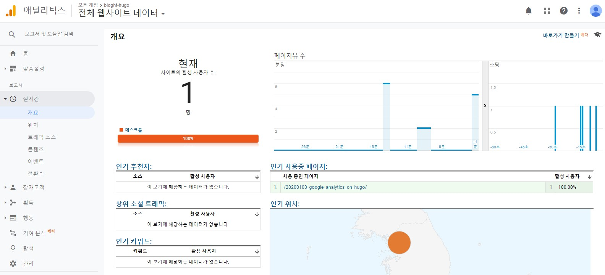
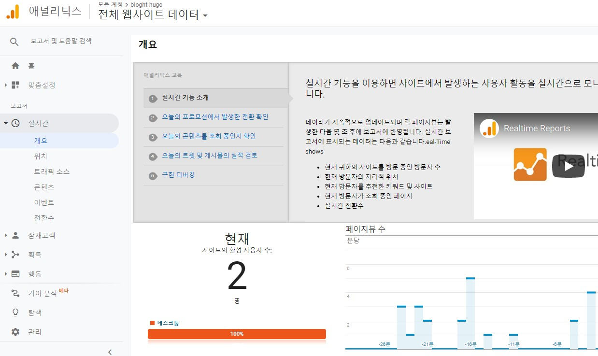

## 서론
블로그는 사막에서 혼자 지낸다는 마음가짐으로 하는 것이지만, 그래도 누가누가 내 블로그에 오는지는 알고 싶은 법이다. 이를 위해 Google Analytics (GA)를 설치한다. [이 글](http://cloudywithachanceofdevops.com/posts/2018/05/17/setting-up-google-analytics-on-hugo/)의 내용을 따라했다. 웹사이트에 GA를 추가하려면 두 가지가 필요하다:
- Google Analytics 계정
- Google Analytics를 추가할 Hugo 웹사이트

## Google Analytics 계정 및 추적 ID 생성

[여기](https://marketingplatform.google.com/about/analytics/)에서 Google Analytics 계정을 생성한다.

GA는 웹사이트나 어플리케이션 등에 대한 데이터를 수집해주는 도구이다. 웹사이트의 경우 수집하는 데이터 종류는 방문한 사람 수, 방문한 사람의 유형, 유입 경로, 취한 행동(회원가입, 다운로드 등)에 따른 방문자 유형 등이다.

GA는 **계정(account)** - **속성(property)** - **보기(view)** 로 구성된다. **속성** 이란 데이터를 수집하고자 하는 웹사이트, 어플리케이션을 의미한다. **계정** 을 생성하고 추적하고자 하는 속성을 추가해 관리하는 방식이다. 각 속성에서는 **보기** 를 이용해 각 속성에서 어떤 데이터를 수집할 것인지 정할 수 있고, 이와 관련된 요약 보고서를 생성 및 열람할 수 있다. GA에 대한 자세한 정보는 [여기](https://ga-study.tistory.com/4)에 잘 정리돼있다.

계정에 블로그 웹사이트를 속성으로 추가하고 자동으로 생성된 추적 ID(Tracking ID)를 확인한다. **UA-123456789-1** 형식으로 돼 있고, 비밀번호 같은 개념이므로 **공유하지 않도록 한다.**

## Hugo 웹사이트에 Google Analytics 추가

앞서 얻은 **추적 ID** 를 **config.toml (or config.yaml)** 의 `googleAnalytics` 변수에 추가하고 저장한다:

```
baseURL: https://examplesite.com
languageCode: en-us
defaultContentLanguage: en
title: author
theme: hugotheme
googleAnalytics: UA-123456789-1 <!-- 여기 -->
disqusShortname: author
enableGitInfo: true
```

## 작동 확인

원래는 1) 추적 Id를 설정하고, 2) Hugo의 GA internal template을 turn on해야 완성이다.    
**하지만** 어떤 테마는 추적 ID만 입력하면 자동으로 GA가 활성화되기도 한다. 자신이 쓰는 테마가 이런 경우에 속한다면 여기서 설치 완료하면 된다.  

작동 확인 방법은 `hugo server` 명령을 이용해 로컬 웹서버를 연다. 그리고 GA의 모니터링 페이지를 확인한다. **만약 잘 작동하고 있다면** 현자 접속자 수가 1 이상일 것이고, **작동하고 있지 않다면** 현재 접속자 수가 0일 것이다.

GA에서 해당 속성 페이지의 실시간 개요 페이지를 연다(**크롬**, **웨일** 기준으로는 북마크 페이지 아래에 맨 왼쪽에 **GA로고** 가 있고, 다음으로 **"애널리틱스"** 글자가 나오고 그 오른쪽에 계정-속성을 선택할 수 있는 단추가 있다).



현재 활성 사용자 수가 0명으로 나온다. 즉, 직접 GA 템플릿을 활성화 해야 한다 (**Cupper-hugo-theme**).

## Hugo Internal Template for Google Analytics 활성화

이 글에서는 `header.html`에 GA를 추가한다. 이렇게 하면 블로그 내 모든 페이지에서 작동하게 된다. 추가할 위치는 필요에 따라 다른 곳으로 선택해도 된다.

1. layouts/partials/header.html을 연다. (**head.html과 헷갈리지 말자**)

- 블로그 `root` 폴더 내 `layouts` 폴더에 `partials` 폴더를 만들어서 여기에 `header.html`을 생성하도록 한다. 직접 `themes` 폴더에 있는 코드를 직접 수정하는 것보다는, 원래 테마 코드는 그대로 보존한 채 root 폴더 내에 `themes` 구조를 복사해서 수정하는 것이 좋다고 한다. 테마에 관한 다른 커스터마이징에도 똑같이 해당된다(나는 이미 원래 코드를 많이 바꿔버렸지만).

2. `{{ template "_internal/google_analytics.html" . }}`를 추가한다

내가 참고한 글과 내 블로그의 config가 다르게 생겨서 임의로 비슷한 위치에 추가했다.

```
<header class="intro-and-nav" role="banner">
  <div>
    <div class="intro">
      <a class="logo" href="/" aria-label="{{ .Site.Title }} home page">
        
      </a>
      <p class="library-desc">
        {{ with .Site.Params.description }}
          {{ . | markdownify }}
        {{ end }}
      </p>
    </div>
    {{ partial "nav.html" . }}
      {{ template "_internal/google_analytics.html" . }}
  </div>
</header>
```

저장 후 확인:


접속자 수가 1명으로 올랐다.

### local 서버 접속자 수는 제외하기

잘 작동해서 기분 좋지만, 로컬 서버 접속 여부는 별로 궁금하지 않을 것이다. 내가 `hugo server`를 통해 접속하는 경우는 추적하지 않도록 바꿔보자.

현재 내 블로그에는 3명(모두 나다)이 접속 중이다(로컬, 노트북, 데스크탑).


[이 답글](https://discourse.gohugo.io/t/how-to-exclude-google-analytics-when-running-under-hugo-local-server/6092/34)을 참고해서 `header.html`을 다음과 같이 수정했다:

```
<header class="intro-and-nav" role="banner">
  <div>
    <div class="intro">
      <a class="logo" href="/" aria-label="{{ .Site.Title }} home page">
        
      </a>
      <p class="library-desc">
        {{ with .Site.Params.description }}
          {{ . | markdownify }}
        {{ end }}
      </p>
    </div>
    {{ partial "nav.html" . }}
    {{- if not .Site.IsServer -}}
      {{ template "_internal/google_analytics.html" . }}
    {{- end -}}
  </div>
</header>
```

`push` 후 결과를 확인해보면...



테마 수정 내용은 원격으로 푸쉬가 안 된다. git status를 보면 추적 대상이 아니다.
깃허브 저장소에서 테마폴더를 클릭하면 원 저자의 저장소로 이동된다. 테마를 서브모듈 형태로 추가했기 때문이다. 즉, 로컬에서 직접 테마의 원래 코드를 수정하면 푸쉬를 하지 못 한다는 것이다. 루트에 테마 구조를 복사한 후 루트에서 커스터마이징 해야 할 듯.

## References

- [Setting Up Google Analytics on Hugo](http://cloudywithachanceofdevops.com/posts/2018/05/17/setting-up-google-analytics-on-hugo/)
- [[GA] 구글애널리틱스 시작, 계정 생성하고 추적코드 설치하기](https://ga-study.tistory.com/4)
